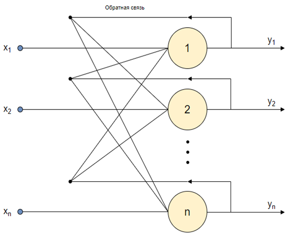

Демо версия размещена на https://soanyway.vercel.app/nn/hopfield/demo.html
# Нейросеть Хопфилда
Нейронная сеть Хопфилда (англ. Hopfield network) — полносвязная нейронная сеть с симметричной матрицей связей. Такая сеть может быть использована для организации ассоциативной памяти, как фильтр, а также для решения некоторых задач оптимизации.

Сеть Хопфилда является абсолютно однородной структурой без какой-либо внутренней специализации ее нейронов. Её классический вариант состоит из единственного слоя нейронов, число которых является одновременно числом входов и выходов сети.
## Использование
1. Запустите демо версию [здесь](https://soanyway.vercel.app/hopfield.html) или откройте index.html в любом браузере
2. В левом окне нарисуйте образ, который сеть должна запомнить, например, букву Т
3. Нажмите Запомнить, затем Очистить
4. Нарисуйте фрагмент образа и нажмите Распознать, сеть должна выдать в правом окне хранящийся в памяти образ
## Примечания
Для сети Хопфилда число запоминаемых образов m не должно превышать величины, примерно равной 0.15*n (где n - размерность входного сигнала и количество нейронов).
### Структурная схема сети Хопфилда
